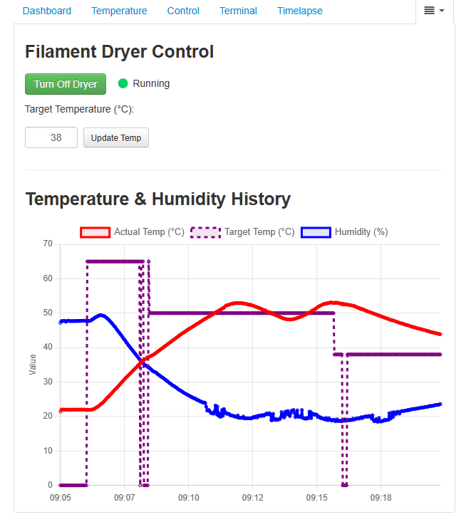

# Octoprint Filament Dryer Controller Plugin

## Requirements

- Python 3.7 or higher
- OctoPrint
- DHT22 sensor
- GPIO support (e.g., Raspberry Pi)

## License

This plugin is licensed under the GPL-3.0 License.